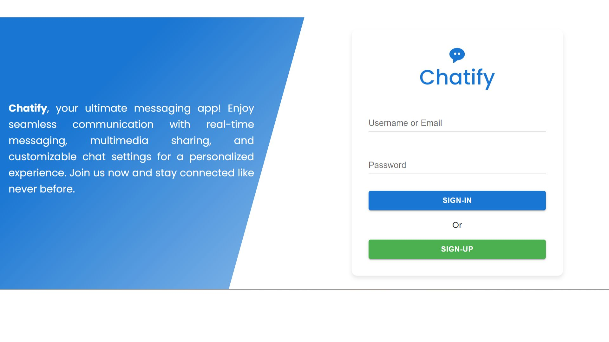
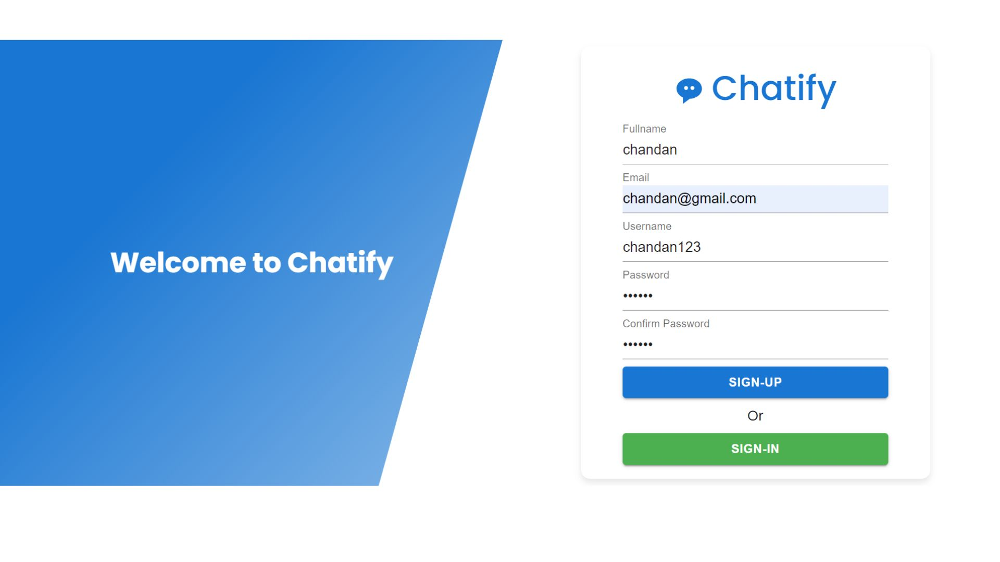
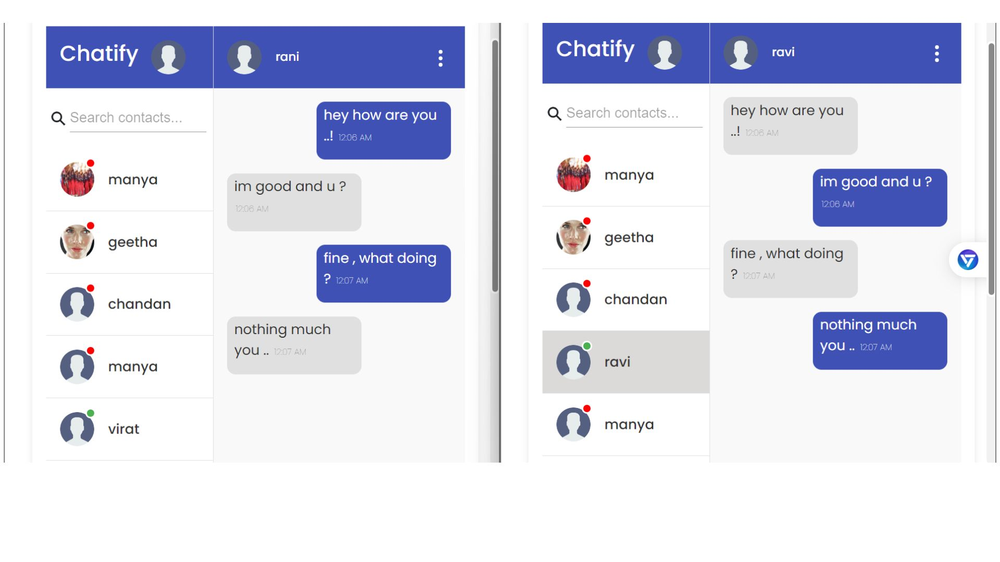
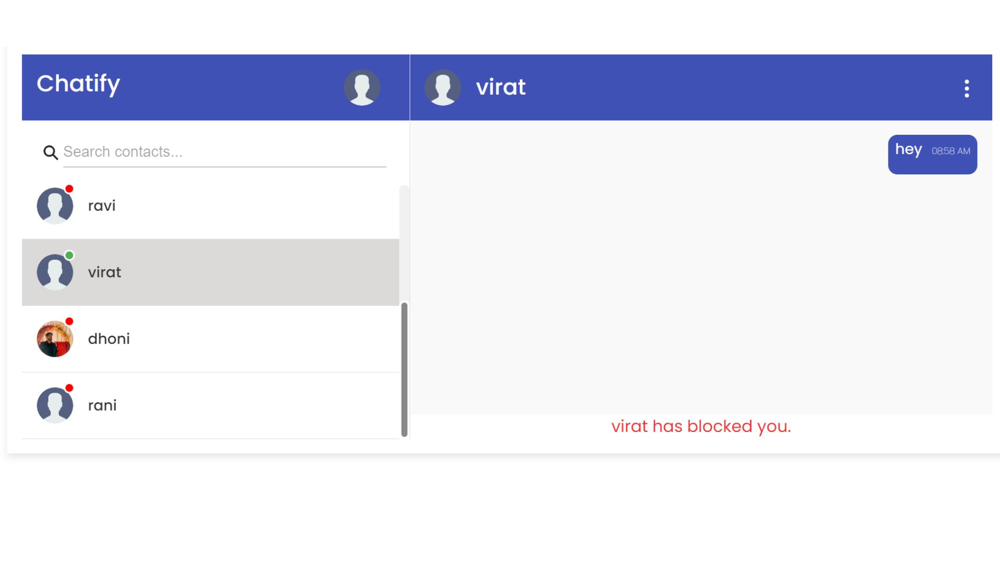
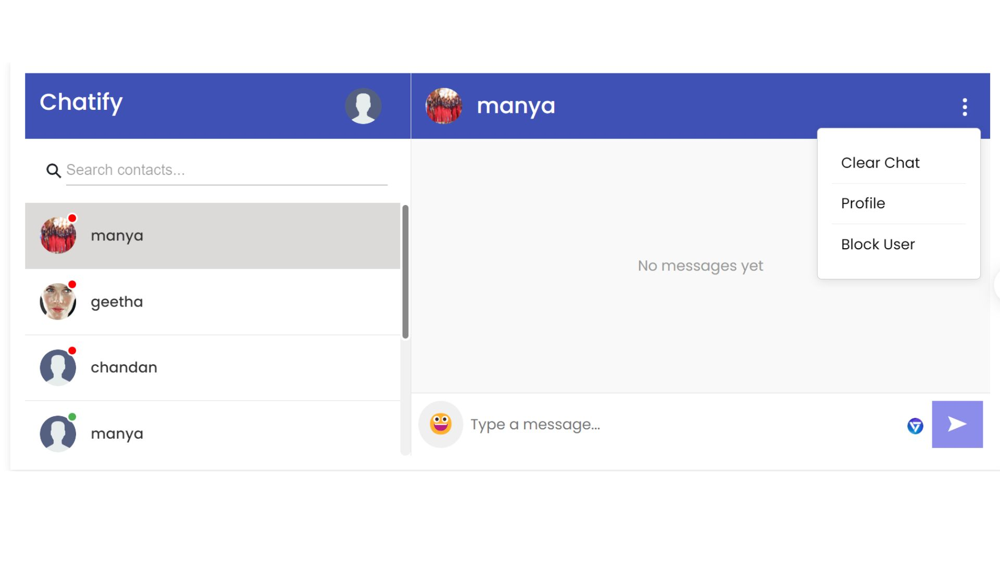
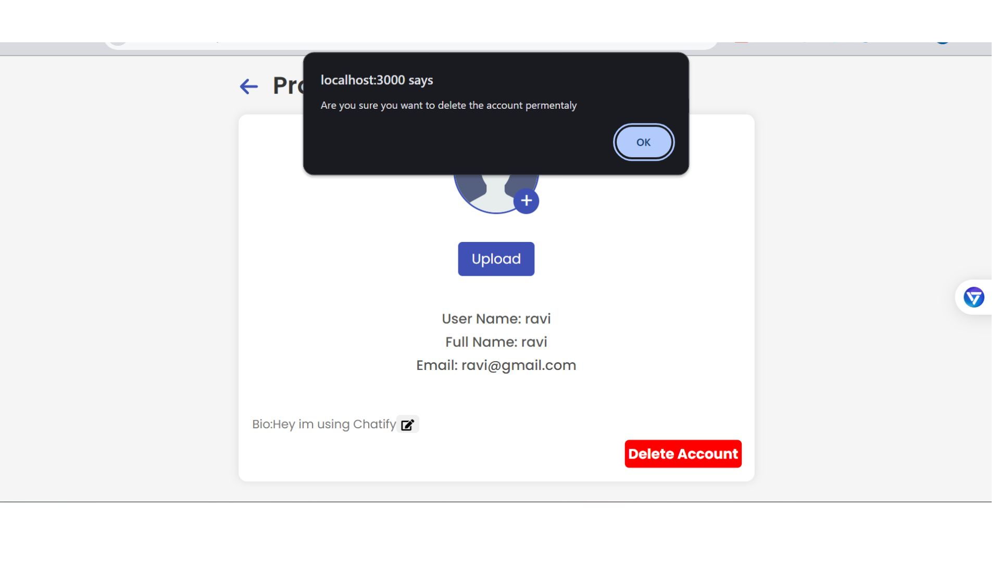
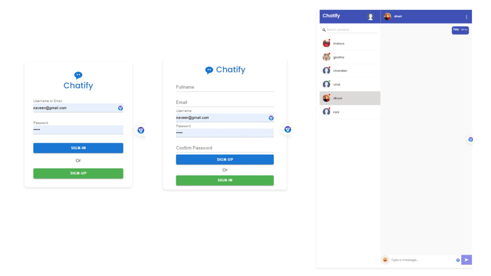

# Chattify: An Instant Messaging Platform

## Overview
Chattify is an instant messaging platform built using the MERN stack (MongoDB, Express.js, React.js, Node.js) that allows users to chat in real-time. It supports features like user authentication, profile management, chat history, blocking users, and more.


## Screenshots








## Features
- User registration and login with email, username, and password.
- Real-time chat functionality.
- Blocking and unblocking users.
- Adding and updating bio.
- Deleting chat history.
- Deleting account permanently.
- Sending emojis.
- Online and offline status indication.
- Profile picture upload and update.
- JWT token-based authentication.
- Responsive design.

## Technologies Used

### Frontend
- **React.js** (version 17 or higher)
- **Redux** (for state management)
- **Axios** (for making HTTP requests)
- **Socket.io-client** (for real-time communication)
- **Material-UI** (for user interface components)
- **React Router** (for navigation)
- **React Icons** (for iconography)

### Backend
- **Express.js** (for creating the server)
- **Mongoose** (for MongoDB object modeling)
- **bcryptjs** (for password hashing)
- **jsonwebtoken** (for authentication)
- **Multer** (for file uploads)
- **Socket.io** (for real-time communication)
- **cookie-parser** (for handling cookies)
- **cors** (for enabling Cross-Origin Resource Sharing)
- **body-parser** (for parsing incoming request bodies)

## Getting Started

### Prerequisites
- Node.js and npm installed on your machine.
- MongoDB database (you can use MongoDB Atlas for a cloud-based solution).

### Installation

   1. **Clone the Frontend repository:**
    ```sh
    git https://github.com/chandankumarm55/Final-year-project-frontend.git
    cd chattify
    ```
 2.**Clone the Backend repository:**
    ```sh
    git https://github.com/chandankumarm55/Final-Year-Project-Backend.git
    cd chatt
    ```

3. **Backend Setup:**
    - Navigate to the `server` directory:
      ```sh
      cd server
      ```
    - Install dependencies:
      ```sh
      npm install
      ```
    - Create a `.env` file in the root of the `server` directory and add the following environment variables:
      ```env
      PORT=5000
      MONGO_URL=mongodb+srv://<username>:<password>@cluster0.mongodb.net/
      JWT_KEY=<your_jwt_secret_key>
      FRONT_END_URL=http://localhost:3000
      ```
    - Start the server:
      ```sh
      npm start
      ```

4. **Frontend Setup:**
    - Navigate to the `client` directory:
      ```sh
      cd ../client
      ```
    - Install dependencies:
      ```sh
      npm install
      ```
    - Update the backend URL in `src/utilities/constant.js`:
      ```javascript
      export const BACKEND_URL = 'http://localhost:5000';
      ```
    - Start the frontend development server:
      ```sh
      npm start
      ```

### Running the Application
- Open your browser and navigate to `http://localhost:3000` to access the frontend.
- The backend server will be running on `http://localhost:5000`.
ased Authentication Testing
- **Objective:** Ensure that users cannot send messages without a valid token.
- **Example:** Test scenarios where the token is missing, expired, or invalid.

## References
- [React.js Documentation](https://reactjs.org/docs/getting-started.html)
- [Redux Documentation](https://redux.js.org/)
- [Material-UI Documentation](https://material-ui.com/getting-started/installation/)
- [React Router Documentation](https://reactrouter.com/)
- [Axios Documentation](https://axios-http.com/docs/intro)
- [Socket.io Documentation](https://socket.io/docs/v4/)
- [Node.js Documentation](https://nodejs.org/en/docs/)
- [Express.js Documentation](https://expressjs.com/)
- [MongoDB Documentation](https://docs.mongodb.com/)
- [Mongoose Documentation](https://mongoosejs.com/docs/)
- [bcryptjs Documentation](https://www.npmjs.com/package/bcryptjs)
- [jsonwebtoken Documentation](https://www.npmjs.com/package/jsonwebtoken)
- [Multer Documentation](https://github.com/expressjs/multer)
- [cookie-parser Documentation](https://www.npmjs.com/package/cookie-parser)
- [cors Documentation](https://www.npmjs.com/package/cors)
- [body-parser Documentation](https://www.npmjs.com/package/body-parser)
- [Material-UI Documentation](https://mui.com/)
- [jsonwebtoken Documentation](https://www.npmjs.com/package/jsonwebtoken)
- [Socket.io-client Documentation](https://socket.io/docs/v4/client-api/)

## Tools and Editors
- **VS Code**: A source code editor that provides a range of features including debugging, syntax highlighting, and Git integration.
- **MongoDB Atlas**: A cloud-based MongoDB service for managing databases.
- **Postman**: A collaboration platform for API development.
